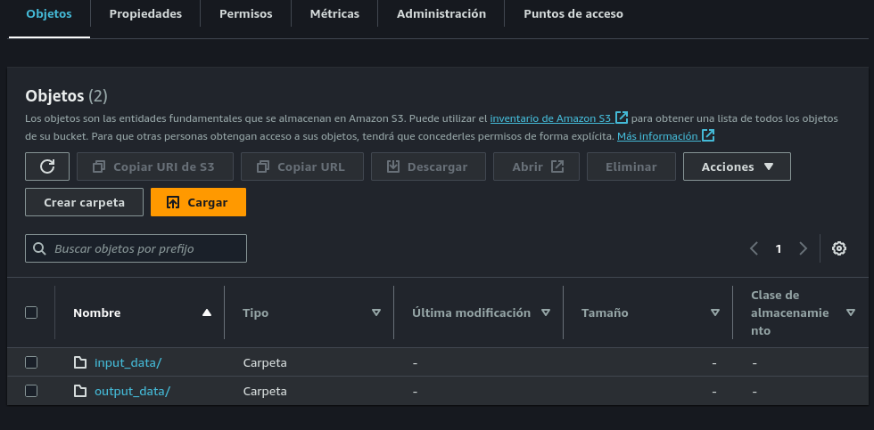
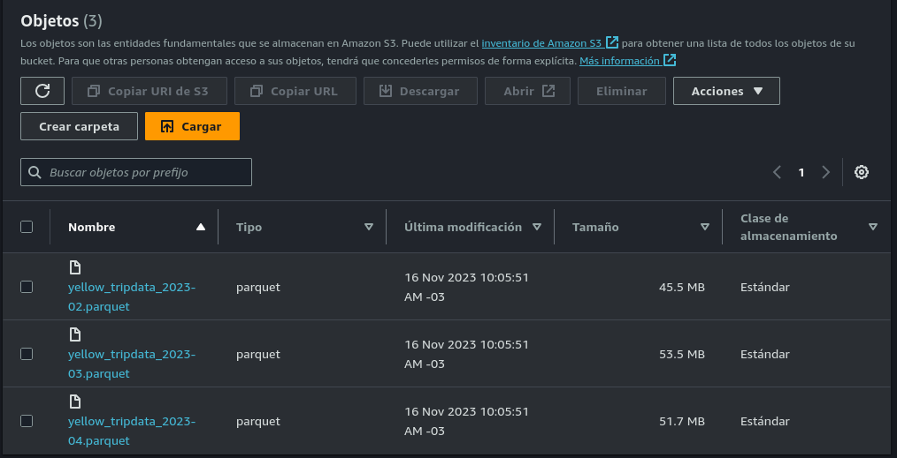
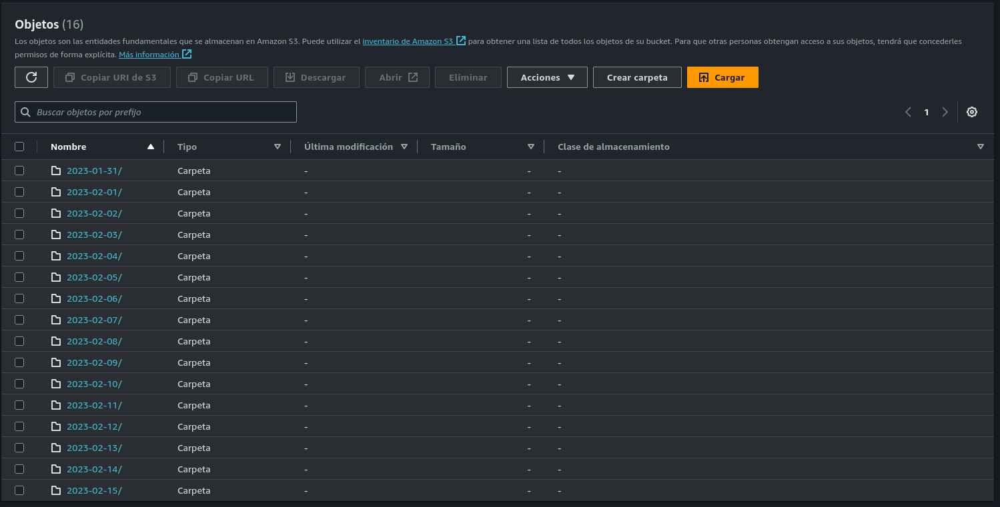

## ETL con Python, Polars y AWS (EC2, S3)

Este script tiene como tarea la siguiente, leer archivos parquet que estan alojados en un subdirectorio de un bucket S3, limpiar los datos, agregar nueva informacion y luego subir archivos particionados dentro del mismo bucket de S3 pero en un subdirectorio distinto

<p align='center'>
  
</p>

En primera instancia, podemos levantar un ambiente ya sea con `conda` o `virtualenviroment`.

Luego procedemos a crear una instancia de EC2 utilizando una una imagen de `Amazon Linux` o `Ubuntu 22.04`. En dicha instancia crearemos nuestro entorno virtual para hacer las configuraciones correspondientes.

```bash
sudo apt update
sudo apt install python3-pip
``` 

Generalmente las instancias de EC2 ya vienen instaladas con Python, de no ser asi debes instalarlo para correr los scripts. Luego de instalar pip, podemos usar el archivo `requirements` para instalar las dependencias necesarias.

Pasando al ETL, en S3 tenemos el siguiente bucket:

<p align='center'>
  
</p>

En el subdirectorio, que dicho sea tambien es un objeto de S3, estan alojados 3 archivos de tipo parquet:

<p align='center'>
  
</p>

Nuestro script realiza las siguientes tareas, crea un string a partir del nombre y el path donde se encuentran ubicados los archivos parquet. Luego crea un LazyFrame que nos servira para agregar nueva informacion a los datos de los archivos parquet. Posteriormente realizamos un join entre el objeto S3 y el LazyFrame que creamos, creamos una nueva columna tomando un dato de tipo `Datetime` y casteandolo a tipo `Date`, ya que nos servira para luego crear particiones. Seleccionamos unas columnas de ejemplos, hacemos un filtro con la nueva columna creada y, ya que estamos trabajando con un LazyFrame, recolectamos los datos y aplicamos un limite, ya que la instancia de EC2 tiene recursos limitados. Finalmente utilizamos pyarrow para particionar nuestro DataFrame y enviamos los datos en archivos de tipo parquet a otro subdirectorio del bucket.

<p align='center'>
  
</p>